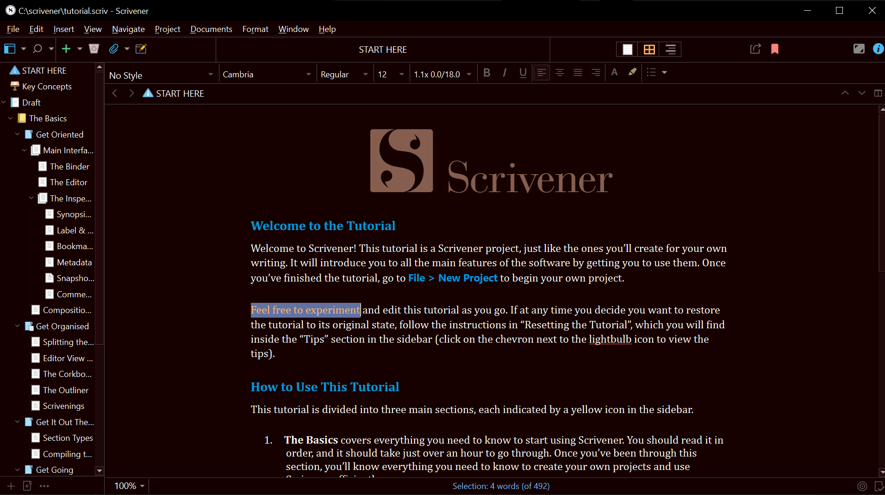

# Scrivener RedDracula theme
Dark theme for Scrivener on Windows 

## Difference 
- Darker
- Slightly Red

## How to install
1. Download .scrtheme file. If the name has changed during download, change it back.  
2. Open Scrivener
3. Menu > File > Options > Manage(Left Bottom) > Import themes
4. Import the downloaded file

## How to tweak
- .scrtheme is actually a zip file. extract and edit 
- Menu > Options > Appearence on Scrivener   

# Credit
Based on [dracula/scrivener](https://github.com/dracula/scrivener)  
